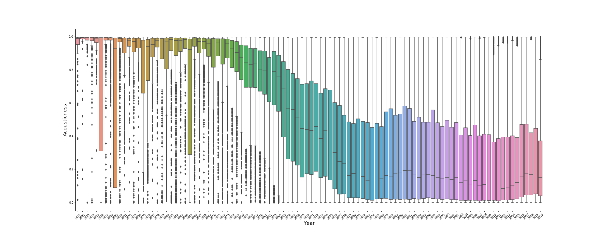
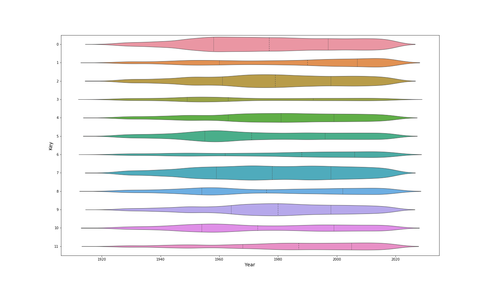
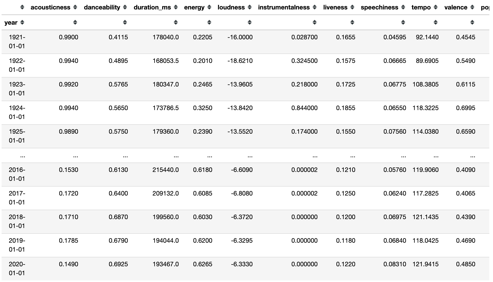
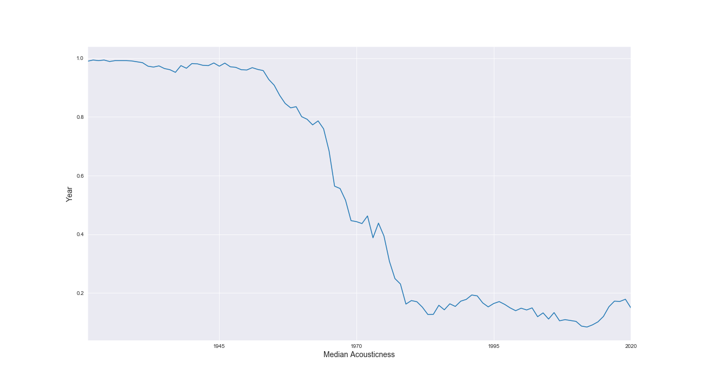
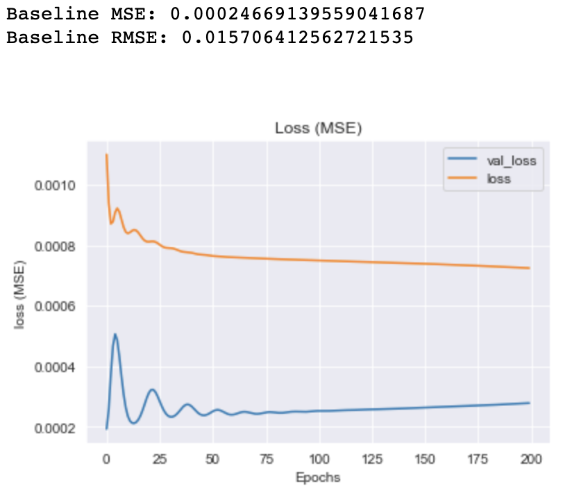
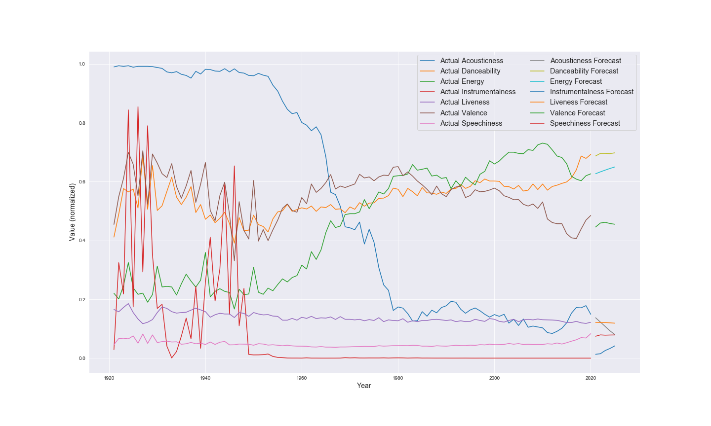

# Project Introduction:
Undoubtedly one of the most popular music streaming platforms today, Spotify, is highly driven by data. Data scientists utilize machine learning for recommender systems which are one of the most popular, and eerily accurate features of the platform, for personally-curated playlists. More thought-out, and even novel features, are constantly sought out to keep users interacting with the platform. 

One idea I had is to see if I could give more meaning to artists who are "ahead of their time". I've heard this said of select artists over the years, and am curious to see if I could give a calculable meaning to this. Of course, artists who are "ahead of their time" are largely famous but more importantly are often partly responsible for initializing the changing the landscape of their genres. Who wouldn't want to know? Spotify uses algorithms to give each one of their songs a numerical profile, based on features such as "acousticness", "danceability", and "tempo".

# Goals:
The main goal of this project is to analyze and forecast the annual (average) trends of features of a large set of (+160k) Spotify songs. **I will attempt to forecast what the values of each feature will likely be in the future, using Long Short Term Memory (LSTM) Recurrent Neural Networks** This will essentially be a data-driven, numerical representation of what the average music might sound like in 5 years. A playlist of songs that can then be attributed most closely to those future feature values can be created and titled "Tracks Ahead of Their Time”, and can serve as a popular attraction for app users.

## Methods
Process based on the OSEMN framework 
* Importing datasets from Kaggle (retrieved from Spotify API).
* Exploring the data and its distributions for each feature, each year. 
* Cleaning out songs which are mislabelled, outlying, and irrelevant to the project. 
* Throwing pre-packaged yearly dataset out, engineering new dataset of aggregated median values per year for each feature.
* ARIMA and LSTM modeling (using engineered yearly dataset) and parameter tuning for lowest RMSE
* Forecasting feature values of the future using a singular function
* Using forecasted feature values to filter through original dataset for songs which most closely match values

## The Data:
There are over 160,000 tracks, released from 1920 to 2020, each with 14 feature values. 

Some of feature definitions from the [Spotify developer page](https://developer.spotify.com/documentation/web-api/reference/tracks/get-audio-features/):

**Acousticness**: A confidence measure from 0.0 to 1.0 of whether the track is acoustic. 1.0 represents high confidence the track is acoustic.

**Danceability**: Danceability describes how suitable a track is for dancing based on a combination of musical elements including tempo, rhythm stability, beat strength, and overall regularity. A value of 0.0 is least danceable and 1.0 is most danceable.

**Liveness**: Detects the presence of an audience in the recording. Higher liveness values represent an increased probability that the track was performed live. A value above 0.8 provides strong likelihood that the track is live.

**Instrumentalness**:
Predicts whether a track contains no vocals. “Ooh” and “aah” sounds are treated as instrumental in this context. Rap or spoken word tracks are clearly “vocal”. The closer the instrumentalness value is to 1.0, the greater likelihood the track contains no vocal content. Values above 0.5 are intended to represent instrumental tracks, but confidence is higher as the value approaches 1.0. 

**Valence**: A measure from 0.0 to 1.0 describing the musical positiveness conveyed by a track. Tracks with high valence sound more positive (e.g. happy, cheerful, euphoric), while tracks with low valence sound more negative (e.g. sad, depressed, angry). 

## Exploring the Data
How has music evolved, numerically, over the years?

Examples: 
### 'acousticness'

There is a sharp distinction for  Acousticness. Highly acoustic music in the early 20th century. Technological advancements in instruments, amplifiers, and production equipment is likely the reason for most recent music to have less acoustic instruments and overall sound.

This data's distribution is telling me that the mean values for acousticness per year might not be a great respresentation of the data as they are subject to skew by the outliers. We might need to create a new yearly dataframe with median values instead. The median values will more accurately represent the majority of the data.

### 'key'

Here we have an idea of the usage of different musical key scales, a categorical feature, over time. 0 and 7 key scales are used the most, as indicated by the thickness of their violins, in most years.

## Feature Engineering
We now know from EDA that we need to use a new dataset which has grouped each year for each value by the median and not the mean. This new dataframe is what we will use for our time series modeling:

## Modeling
I performed ARIMA and LSTM modeling and tuning initially using the 'acousticness' feature, whose time series is plotted looks like this:

The real goal here was to practice using LSTM's however I did baseline modeling with ARIMA. After numerous ARIMA and LSTM models, using logged values, differenced data, LSTM layer stacking, Bidirectional LSTM layering, and more, the model which gave me the lowest Root Mean Squared Error (RMSE) was an LSTM model which utilized 1-lag differenced data.

**Best RMSE: LSTM with differenced data**

### Brief Intro to LSTM Neural Networks
So how do LSTM's work exactly? To start, LSTM stands for Long-Short Term Memory. Like other Neural Networks, there are layers and hidden layers which can be fine-tuned. However the nature of what is going on with this Recurrent Neural Network (RNN) is a bit different. LSTM's models essentially give greater weight to short term data points, while forgetting older, long-term data points. The data must be sequenced into a series of input steps (which you define) for each output step (step being the value for that point in time). The output step is then fed back into the next sequence of input steps, forgetting the oldest step. 

### Forecasting Future Values with Best LSTM Model
Here is a chart representing the forecasts to 2025 for all features which were normalized (and could fit on the same y-axis):

## Filtering For Artists "Ahead of Their Time"
I decided to drop some features from the modeling which had the same median values throughout history, such as 'explicit' and 'mode'.

So our dataset did not contain any songs which completely matched all of the features' predicted (median) values. I resorted to filtering through the data using an interval of each feature's model RMSE from it's predicted value, for songs most close to the forecasted values of 2025.

**Most "Ahead of Their Time" Artist:** 
[Twenty One Pilots - Tear In My Heart](https://open.spotify.com/album/3cQO7jp5S9qLBoIVtbkSM1?highlight=spotify:track:3bnVBN67NBEzedqQuWrpP4)

**Second Most "Ahead of Their Time" Artist:**
[INXS - Beautiful Girl](https://open.spotify.com/album/66ocxSzZ98wk1rWNfrvU8u?highlight=spotify:track:6N81xlWzMaEYhjHry55OSI)

**Third and Fourth Most "Ahead of Their Time" Artists:**
[Luh Kel, Lil Tjay - Wrong (feat. Lil Tjay) Remix](https://open.spotify.com/album/3bt4LNUYoC2ELK8HBa7rjs?highlight=spotify:track:1Ml32gIRsMAQuUTEt8hwpZ)

[Clean Bandit, Zara Larsson - Symphony (feat. Zara Larsson)](https://open.spotify.com/album/4b13SJlne61y53KSEwuQtD?highlight=spotify:track:1x5sYLZiu9r5E43kMlt9f8)

The one song we found which had the most in common with the 2025 forecast (7 out of 10) feature ranges was Twenty One Pilots - 'Tear In My Heart'. This song was within our 'danceability', 'duration_ms', 'energy', 'tempo', 'valence', 'popularity', and 'key' error ranges from the actual forecast values. A song with 6 out of 10 shared features was INXS - 'Beautiful Girl'. 2 songs shared 5 out of 10 values. 12 songs shared 4 out of the 10 values.

## Conclusions
We have successfully forecasted each of our features. So what do they tell us? Our model predicts that by 2025, the average (median) song will possess the following characteristics:

Tempo will have increased to back around 122.2 BPM. Loudness will have continued to rebound, and reach a median of nearly -6db. (quite loud!) Instrumentalness in songs could possibly have made a comeback, increasing from 0. Speechiness (vocals/spoken words) will have plateaued. Acousticness will be much lower again, down to 0.08. Average Popularity will continue to grow. Valence (positivity/happiness) will have dipped and plateaued at 0.455. Energy will continue to rebound and hit 0.649. Danceability will more or less plateau as well, only rising by a small fraction to 0.697. In otherwords, peak danceability is here to stay for the next 5 years. 

After subsequent research, it is often suggested that simple time series', as in with less data points, generally do better with ARIMA modeling, while LSTM models are potentially better and more efficiently performing with very complex time series. This considered, we were able to obtain a lower RMSE with LSTM modeling, using stationarized data, for our final forecasting of each feature!

## Further Recommendations

If possible, we can access the Spotify API next and query the entire Spotify library for those most ahead artists with all features. Spotify lists over 50 Million songs in total. There is a much better probability of finding songs which completely matched the future averages for each feature modeled.

It would also be interesting to see a form of clustering done on these songs, if there are a greater number and better matches. If there were enough returned within our dataset, it would be possible with what we have.

I would also like to further extend this forecast to individual genres and see how each genre has evolved over time, and which artists within those genres have been playing music of those values much earlier.

Lastly, more time allocation to improving the model layering and/or parameters would help the accuracy of our predictions.

